# Scenario Gallery

Ten of the eleven shipped scenarios, each run once and shown through the
figures the run itself wrote. Every image on this page is a product from the
`plots/` directory of a run, reduced to the page width and otherwise
untouched. The smoke scenario exists for the test suite and is left out.

Any scenario runs by path from the package root:

```bash
julia --threads=3 scripts/run_full_sim.jl <RUN_ID> scenarios/<file>.toml
```

One command regenerates this page. It runs the ten scenarios one after
another (about 40 minutes of wall time), reduces the figures, and records
every run and every file in `docs/src/assets/PROVENANCE.toml`:

```bash
julia docs/render_assets.jl
```

The components are paced against wall time, so the totals below belong to
one realization on one host: another machine reproduces the regimes and the
shapes of the curves, not the counts to the batch. The regime each scenario
is built to reach follows from its link budget and is derived in the
coverage matrix of `scenarios/README.md`.

## Realized Totals

```@eval
using Markdown, TOML
import DeepSpaceTelemetry
record = TOML.parsefile(
    joinpath(pkgdir(DeepSpaceTelemetry), "docs", "src", "assets", "PROVENANCE.toml"),
)
order = [
    "nominal_8h",
    "stress_8h_bursty",
    "recovery_12h_seasonal",
    "abstraction_gaussian_peak",
    "backlog_recovery_sine",
    "drop_policy",
    "explicit_schedule",
    "long_30d_seasonal",
    "long_segments_2400s",
    "external_ingest",
]
runs = Dict(basename(run["scenario"]) => run for run in values(record["runs"]))
rows = map(order) do stem
    run = runs[stem * ".toml"]
    r = run["realized"]
    days = run["mission_days"]
    share = round(100 * r["delivered_within_requirement"] / r["generated"], digits = 1)
    "| `$stem` | $(isinteger(days) ? Int(days) : days) | $(r["generated"]) | " *
    "$(r["ground_total"]) | $(r["ground_live"]) | $(r["ground_archive"]) | " *
    "$(r["lost_count"]) | $(r["retry_count"]) | " *
    "$(r["onboard_buffer_start"]) → $(r["onboard_buffer_end"]) | $share % |"
end
header =
    "| Scenario | Days | Batches | On the ground | Live | Archive | Lost | " *
    "Failed transfers | Buffer, first → last | Within 24 h |\n" *
    "|---|---|---|---|---|---|---|---|---|---|"
stamp(key) = join(sort!(unique(String(run[key]) for run in values(runs))), ", ")
origin =
    "Runs of $(stamp("date")) at commit `$(first(stamp("commit"), 7))`, package " *
    "version $(stamp("package_version")), Julia $(stamp("julia_version"))."
Markdown.parse(join([header; rows; ""; origin], "\n"))
```

*Batches* counts every batch of the run, the pre-populated backlog included.
The buffer column gives the onboard buffer at the first and at the last row
of the metrics profile, and the last column the share of all batches on the
ground within the 24-hour delivery requirement.

## The Mission Summary

Each scenario opens with its mission summary. The top panel carries the link
capacity in percent of its peak and, on the right-hand axis, the onboard
buffer; where a disruption lowers the link, the nominal capacity remains as a
dotted curve behind the effective one. The middle panel accumulates the
batches on the ground, the archive share in green under the total. The bottom
strip accumulates the lost batches and is present whenever the loss channel
is enabled. Shaded bands mark events on all three panels — a blackout with
its fading recovery ramp, a generation gap, an interval with the recorder
full, a low-latency period — and a solid upright rule marks a declared event
marker.

## Nominal Operations

`scenarios/nominal_8h.toml`: seven days of 8-hour passes on the physical
link, 230 kbit/s down against 75 kbit/s produced, flat within the pass; no
backlog, no disruption, 1 % Bernoulli loss.

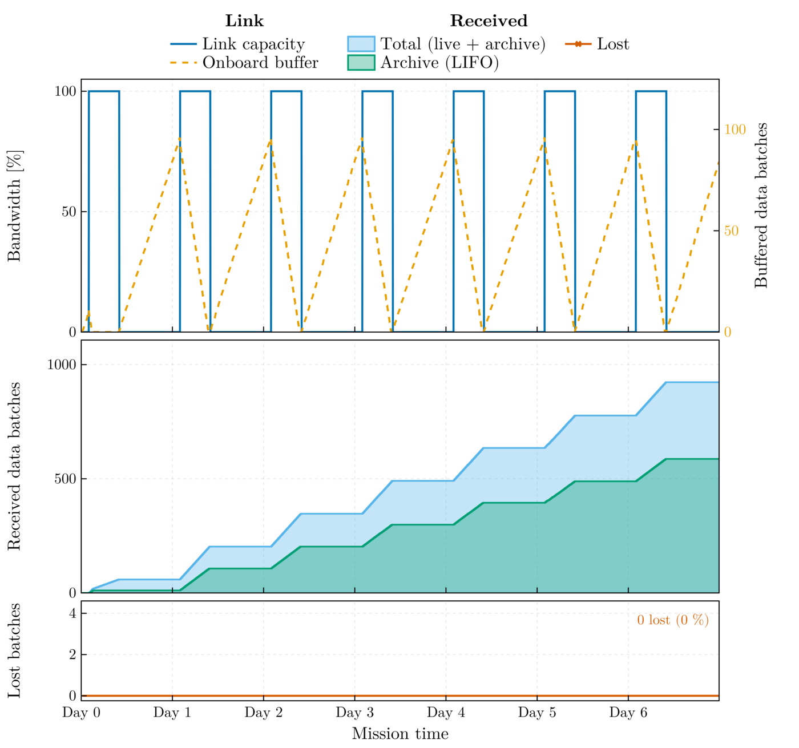

The balanced case. One pass can carry 145.7 batches against the 144 produced
per day, so every pass ends with the buffer empty and every blind spot
refills it to 96 batches, sixteen hours of production. Within a pass the live
batches cross as they are generated and the remaining capacity drains the
archive, which therefore grows at about twice the live rate.

## Growth under Disruptions

`scenarios/stress_8h_bursty.toml`: the same link and passes with a two-day
backlog, a bursty Gilbert–Elliott channel (stationary loss 6.25 %), three
scheduled events, and one event marker.

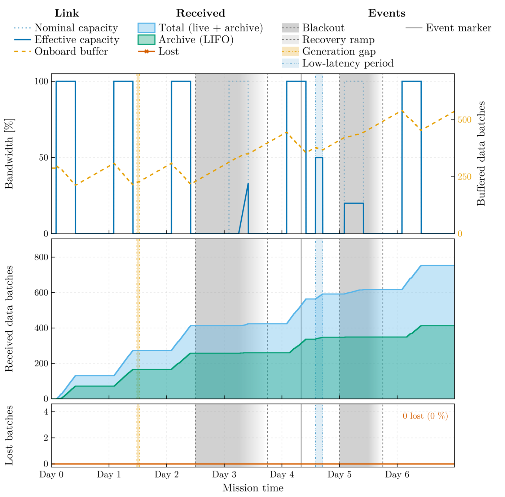

After retransmissions the link delivers fewer batches per pass than a day
produces, so the backlog cannot shrink, and each disruption adds to it. The
18-hour solar-flare blackout on day 2.5 removes one pass except for what the
first hours of its 12-hour recovery ramp let through, and the partial
ground-station outage on day 5 holds a pass at a fifth of its capacity. The 15-minute antenna repointing on
day 1.5 is a generation gap, not a link event. The marker on day 4 opens,
six hours later, a three-hour low-latency period at half capacity.
Retransmission recovers every rejected transfer, so the lost strip stays at
zero while the buffer ends the week near twice its initial level.

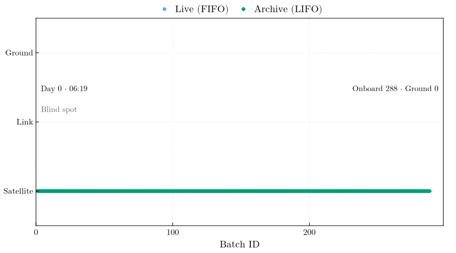

The same run, batch by batch ([GIF Animation](@ref)). Each row is a stage —
buffered on the satellite, in flight on the link, delivered on the ground —
and the color the routing family: sky blue live (FIFO), green archive
(LIFO), the marker shape repeating the distinction. Live batches cross as
they are generated, so the sky-blue runs mark the passes; between them the
archive segment grows backward in batch identifier, contiguous with the live
tail.

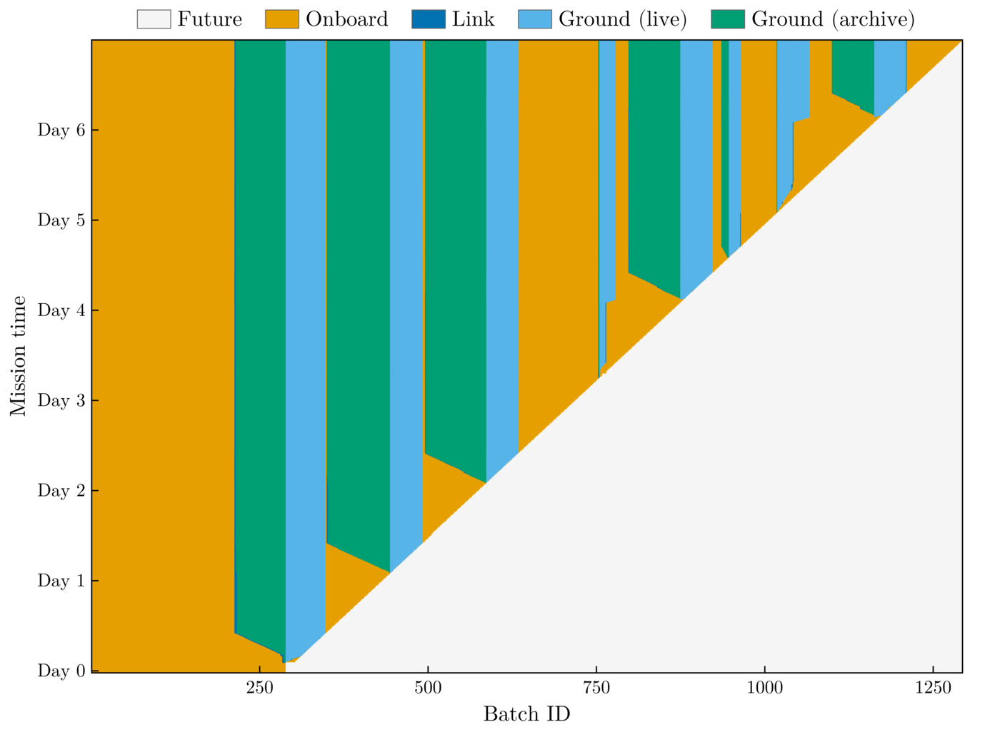

The batch-state raster ([Batch-State Raster](@ref)) is the routing doctrine
in one panel: one column per batch, mission time upward, one color per
state. The diagonal is generation. Each pass turns two blocks of columns to
the ground colors: the sky-blue block of the batches generated during the
pass, and to its left the green block of archive batches, whose lower edge
slopes because the newest archive batch goes first. The columns still in
the onboard color at the top are the backlog the week never cleared; the
flare and the outage appear as passes whose blocks stay narrow.

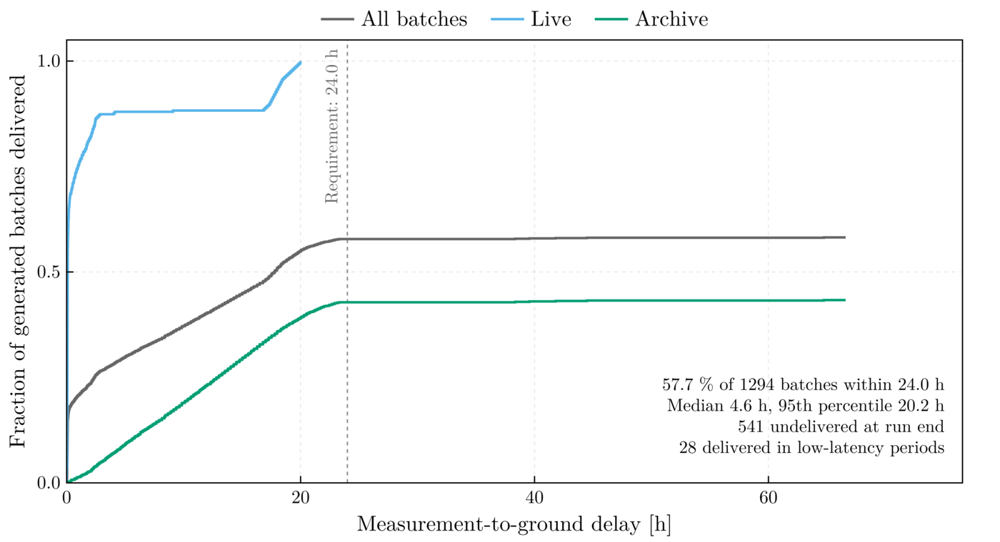

The delivery delay is the time from the end of a batch's measurement to its
arrival on the ground. Every live batch arrives within the requirement.
Under the LIFO backfill an archive batch either arrives within about a day
or stays behind for the rest of the week, so the archive curve and the curve
of all batches level off at the requirement; the level of the latter is the
compliance fraction of the run.

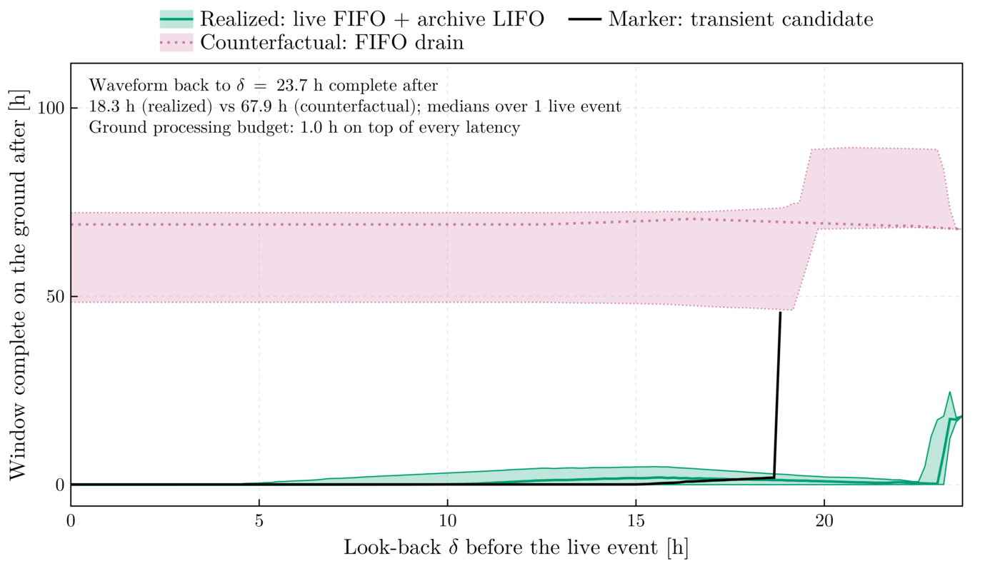

The alert latency ([Alert-Latency Metrology](@ref)) answers the question the
doctrine exists for: after a live event, how long until the data of the
preceding hours are complete on the ground. The realized routing completes
about a day of look-back within a day; a first-in, first-out drain of the
same service completions would need close to three.

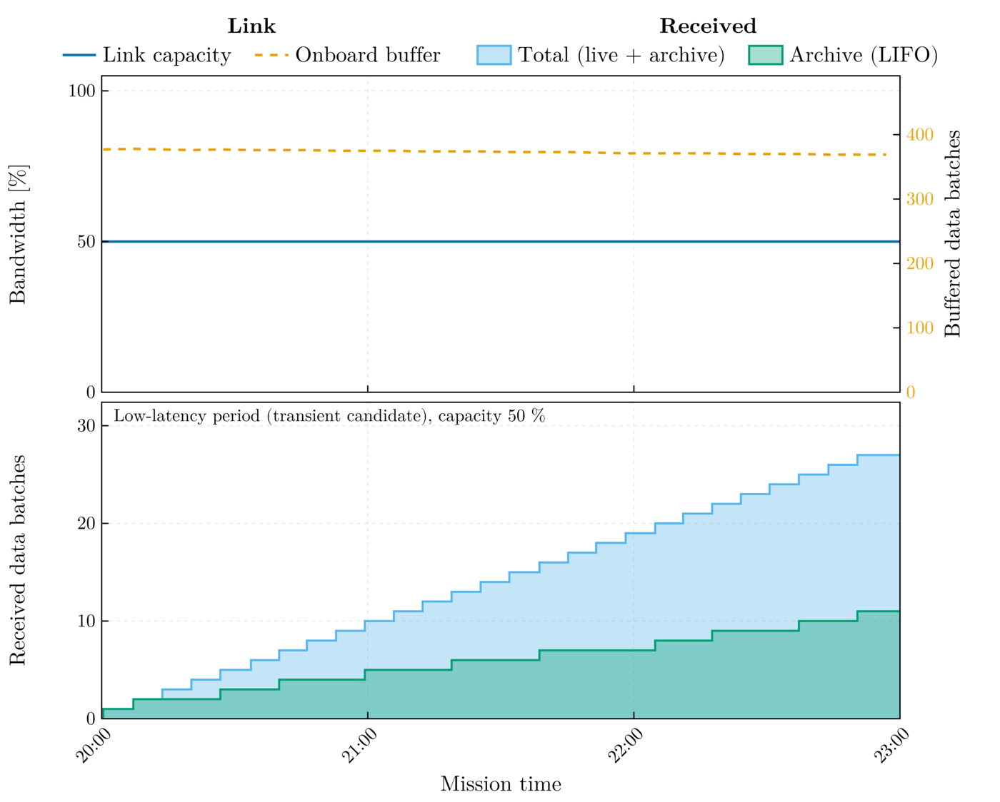

Every contact window receives a session figure with the mission clock on the
time axis and the counts starting at zero. This one is the low-latency
period the marker triggered: three hours at half capacity, about nine
batches per hour.

## Recovery at the Seasonal Peak

`scenarios/recovery_12h_seasonal.toml`, the reference scenario and the
content of `config.toml`: the event timeline of the stress scenario from
21 June, when the seasonal extension widens the passes to 12 hours.

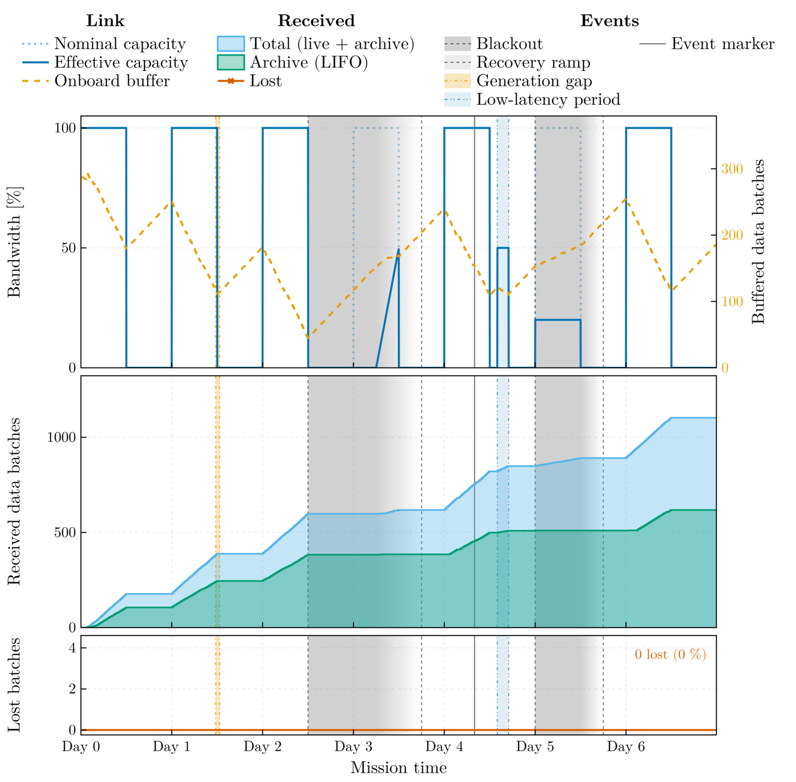

A 12-hour pass carries about 210 batches against 144 produced per day, so
an undisturbed day lowers the buffer by some 65 batches. The flare and the
outage each cost about one pass, and the week ends with the backlog below
its initial level where the 8-hour passes of the stress scenario nearly
double it.

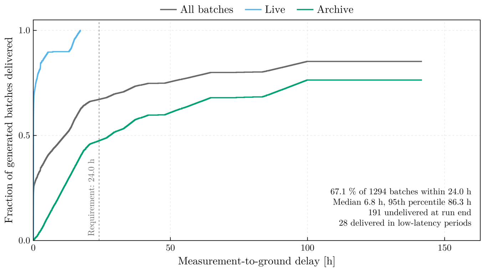

With capacity to spare, the backfill reaches past the newest day of archive:
the archive curve keeps rising beyond the requirement, in stages that are
the successive passes working backward through the initial backlog.

## Shaped Pass Profiles

`scenarios/abstraction_gaussian_peak.toml` and
`scenarios/backlog_recovery_sine.toml` replace the physical rate pair by a
peak capacity of 60 batches per hour under a profile of the window
progress: Gaussian with σ = 0.15, a narrow-beam pass with a mean factor of
0.38, and sine, zero at both horizons with a mean factor of 0.5.

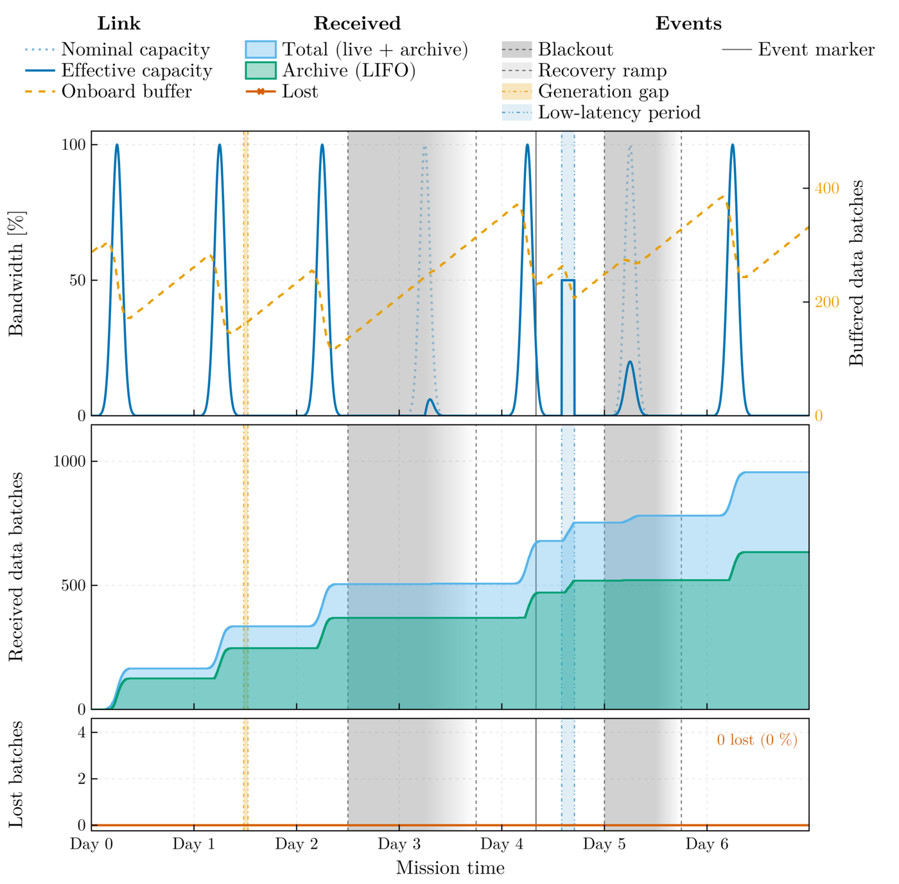

The Gaussian scenario carries the event timeline of the stress scenario.
Capacity concentrates around the culmination, so the received count rises
as an S-curve within each pass, and the flare, whose blackout ends at one
culmination, leaves that pass a few percent of its capacity.

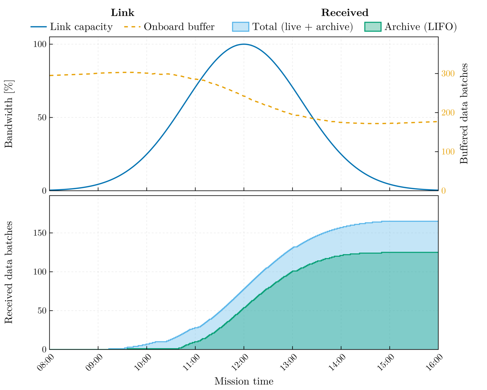

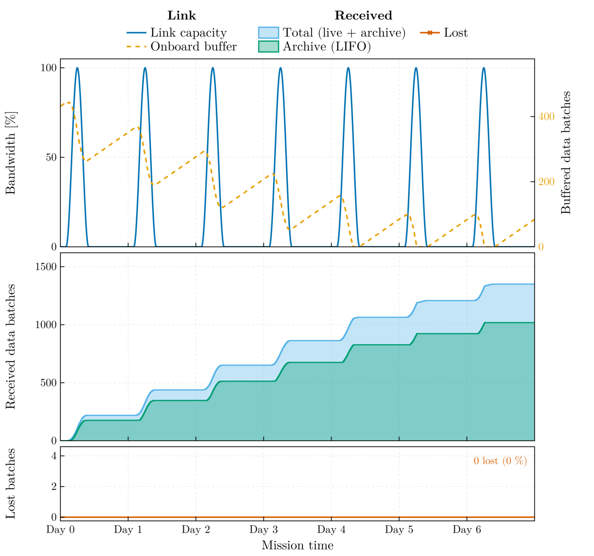

The sine scenario starts from a three-day backlog under 10 % Bernoulli loss
and no disruption. Each pass delivers more than a day produces, the buffer
falls from pass to pass, and from the fifth pass on it reaches zero before
the pass ends.

## Drop Policy

`scenarios/drop_policy.toml`: three days on the physical link with 20 %
Bernoulli loss and `on_loss = "drop"`, so a rejected transfer is not
repeated.

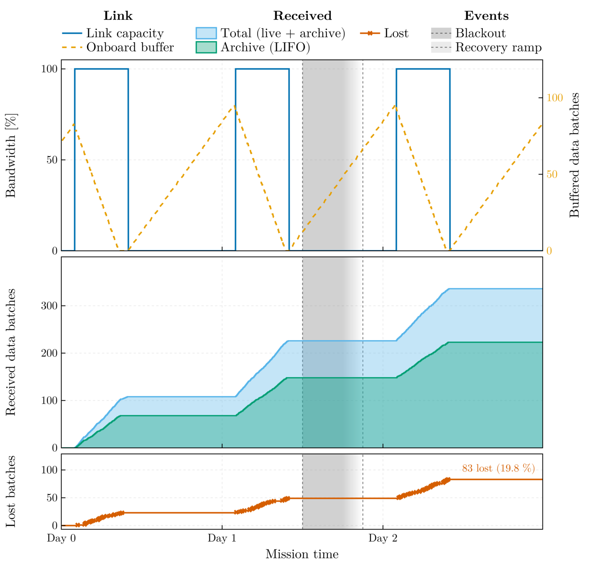

About one transfer in five is lost for good, and the lost strip rises
through every pass. With no retransmission traffic the passes clear the
buffer. The partial outage on day 1.5 falls into a blind spot and costs
nothing.

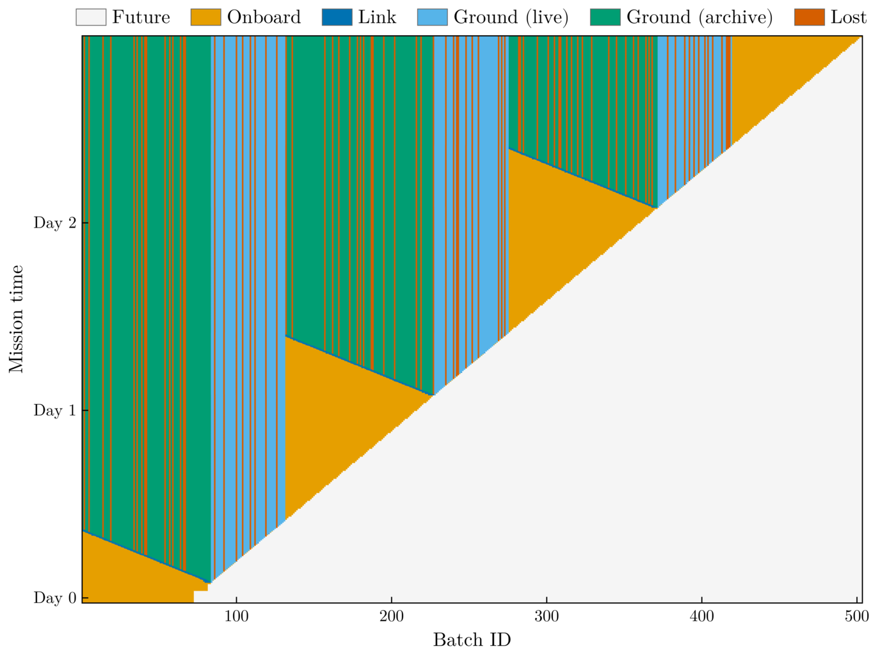

In the raster the lost batches are the vermilion columns scattered through
the delivered blocks: mask state 4, which the point-wise masks keep blanked.

## Explicit Pass Schedule

`scenarios/explicit_schedule.toml`: the passes are listed one by one instead
of being generated, with the pass of day 2 shortened to 6 hours, the pass of
day 3 missed, and the pass of day 5 extended to 12 hours.

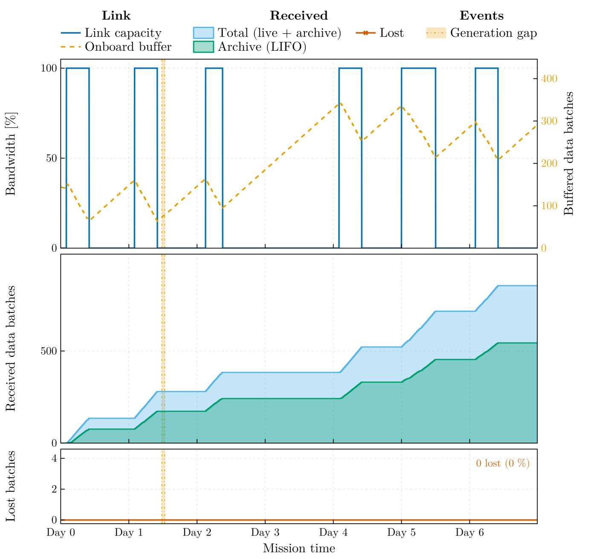

The missed pass leaves a blind spot of 41 hours, across which the buffer
grows by more than a day and a half of production; the extended pass two
days later recovers part of it.

## Thirty Days with a Contact Gap

`scenarios/long_30d_seasonal.toml`: thirty days from 1 March at 7200× with
the seasonal extension, two missed passes and a shortened one, a 12-day
interval without contact, five disruptions, and two event markers.

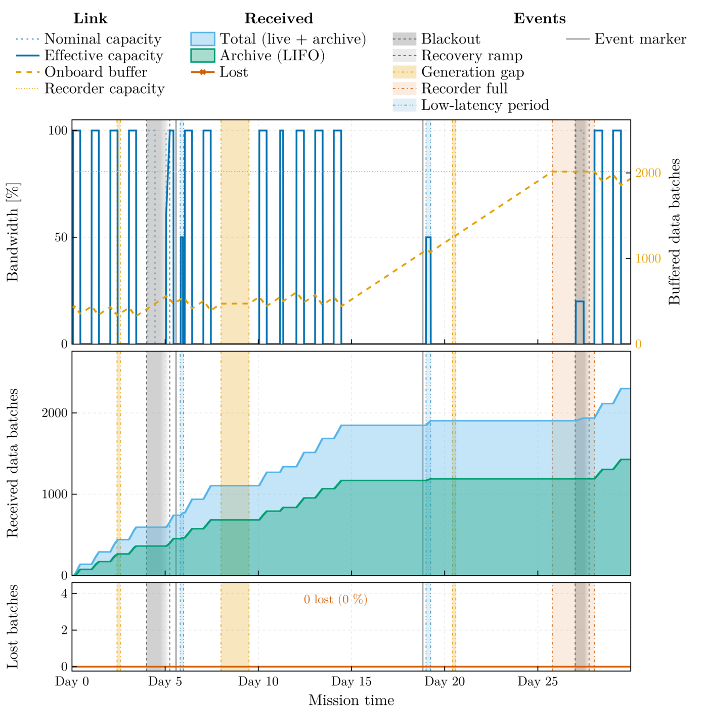

The long horizon exercises what a week does not. A 36-hour safe mode on
day 8 is a generation gap that coincides with two missed passes: the buffer
stays level. From day 15 no pass arrives for twelve days, the buffer climbs
to the 14-day capacity of the on-board recorder (the dotted level on the
buffer axis), and from there until a pass lowers it again every new batch is
discarded, the interval shaded as *Recorder full*. The second marker falls
inside the gap and still opens its low-latency period.

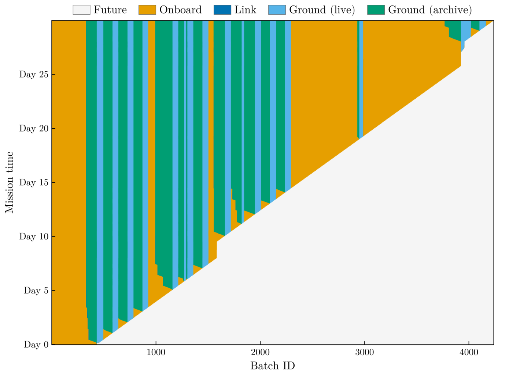

In the raster the generation diagonal has two vertical steps, the safe mode
and the recorder-full interval, during which mission time advances without
new batches.

## Coarse Batches

`scenarios/long_segments_2400s.toml`: 2400-second segments at 0.5 Hz, three
per batch, so a batch spans two hours and a day produces twelve.


With one batch every forty minutes of contact, the counts are visible
staircases at the scale of the week and the buffer moves in single batches.

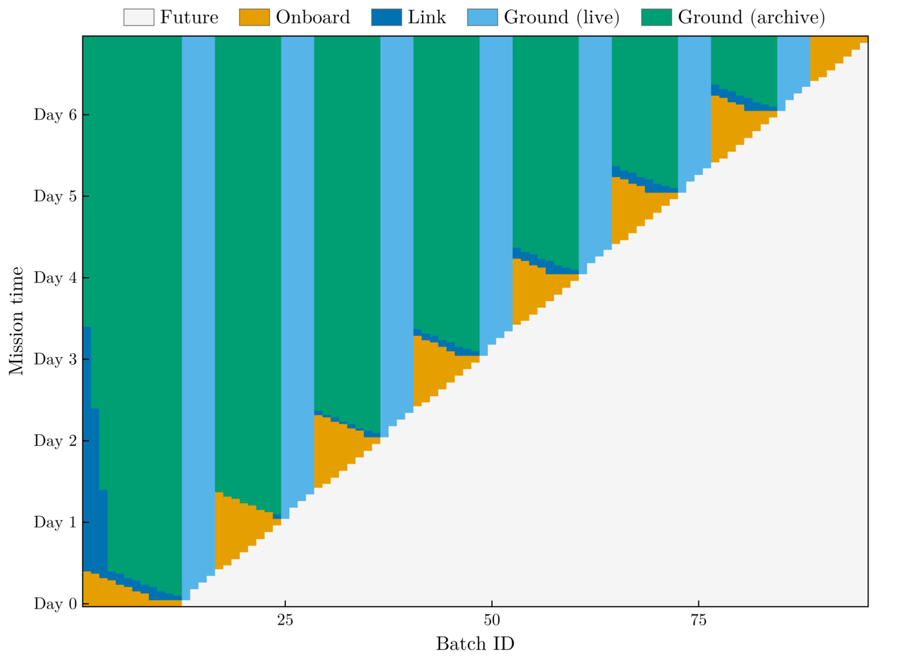

At this batch size the raster resolves single batches. The stepped lower
edge of each green block is the LIFO order, one batch per forty minutes
from the newest backward, and the dark-blue cells are batches in flight on
the link. The three oldest batches stay there across the blind spots until
a pass has delivered everything newer.

## External Ingestion

`scenarios/external_ingest.toml`: two days reading the generated example
series (16 Hz) through the same pipeline; the series is written by
`scripts/maintenance/generate_example_strain.jl`.

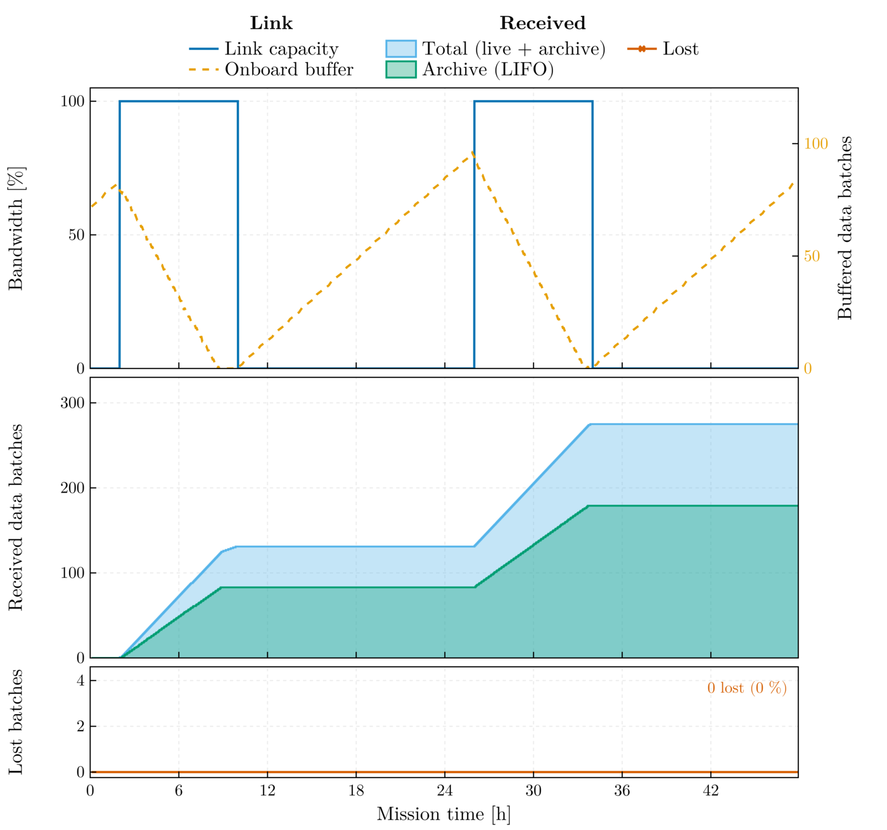

The telemetry layers do not distinguish the payload source: segmentation,
batching, routing, and the figures are those of the synthetic runs.
