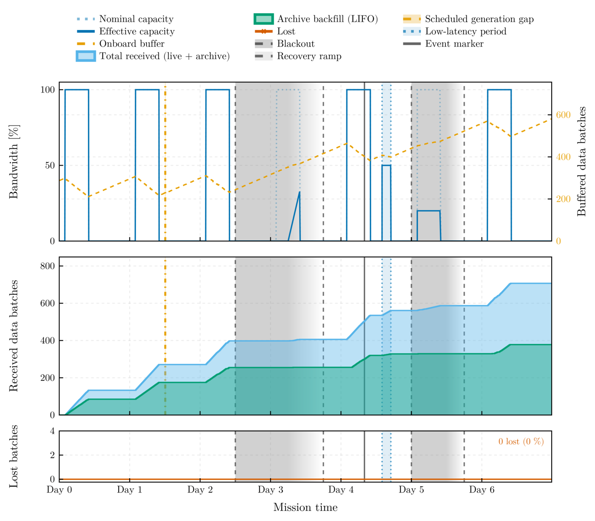

# DeepSpaceTelemetry

A Julia framework simulating the telemetry environment of deep-space science missions — contact windows, link physics, queuing, loss, and disruption — with the **LISA (Laser Interferometer Space Antenna)** mission as the shipped scenarios (a library under `scenarios/`).

## Overview
Deep-space missions communicate on asymmetric duty cycles: a daily ground-station contact window followed by a long blind spot in which science data accumulates onboard. This framework simulates the physics, link constraints, and queuing logic of that regime end to end. The shipped configuration models LISA — orbiting the Sun 50 million kilometers behind Earth, with an 8-hour DSN window against a 16-hour blind spot, and amplitude-calibrated gravitational-wave strain as the payload — while the telemetry, channel, and queuing layers remain mission-agnostic. "DSN" denotes throughout a deep-space ground-station network in the generic sense; the LISA passes are ESA ESTRACK 35 m antenna passes.



One week of `scenarios/stress_8h_bursty.toml`: 8 h daily passes on the
physical link, a bursty Gilbert–Elliott channel, an 18 h solar-flare blackout
with a 12 h recovery ramp on day 2.5, a partial ground-station outage on day
5, and a scheduled generation gap on day 1.5. The onboard buffer doubles from
288 to 581 batches across the week while 707 batches reach the ground and
retransmission recovers all 47 rejected transfers.

## Installation

Requires Julia ≥ 1.12. The package is not registered in the General
registry and is used from a clone of the repository, which carries the
scripts, the scenario library, and the benchmarks; every run is written
under the clone's `data/runs/` directory:

```bash
git clone https://github.com/PaulGoG/DeepSpaceTelemetry.jl.git
cd DeepSpaceTelemetry.jl
```

## Capabilities
* **Payload**: a binary flag series marking the segments that hold a declared event (`0` noise only, `1` flagged signal), or ingestion of an external continuous CSV time series.
* **Link capacity**: either the batches-per-hour abstraction or the physical rate pair `downlink_kbps` / `onboard_data_rate_kbps`, with the catch-up ratio and the capacity of one nominal pass against the daily production reported at start-up.
* **Pass profiles**: `sine`, `sigmoid`, `gaussian`, or `flat` capacity over the pass; the validator states the profile mean when a shaped profile meets a physical rate.
* **Contact schedule**: seasonal pass-duration modulation, per-date exceptions, explicit pass lists (TOML or CSV), and low-latency periods at a station-availability capacity fraction.
* **FIFO/LIFO routing**: live transmission first (FIFO), then the archive backfill in strict LIFO order, so alert pipelines extend a live event's waveform backwards in time without gaps.
* **Stochastic packet loss**: per-transfer loss from a memoryless Bernoulli or a bursty Gilbert–Elliott channel, a retransmit/drop policy, and retransmissions deferred by the round-trip light time of the configured range; retry-exhausted batches land in `lost/` (data preserved, mask state `4`).
* **Disruption events**: scheduled link disruptions (full or partial blackout, linear recovery ramp, elevated loss) and scheduled generation gaps such as antenna repointing; the on-board recorder ceiling discards data at capacity and records the loss as a gap.
* **Event markers**: declared instants stamped into the batch metadata and the transmit log; the alert-latency and delivery-delay metrics are evaluated at each marker, with an optional triggered low-latency period.
* **Post-processing products**: the exact batch-state history replayed from the event logs (`telemetry_mask_timeline.csv`), point-wise 0/1 availability masks, metrology tables, mission and session figures, an HDF5 export of every product with provenance attributes, and a publication export at a declared printed width with a provenance sidecar.
* **Scenario library**: eleven complete configurations under `scenarios/`, from a 12-second smoke run to a 30-day seasonal mission, each validated by the test suite.
* **Validated configuration**: every tunable has a documented safe interval; `validate_config` rejects code-breaking values and retired keys with a precise `[CONFIG]` message and warns on suspicious ones before any data is generated. All RNGs are seeded from the configuration.

Navigate the manual using the sidebar: the physics engine, usage and configuration, the filesystem analysis interfaces, and the full API reference.